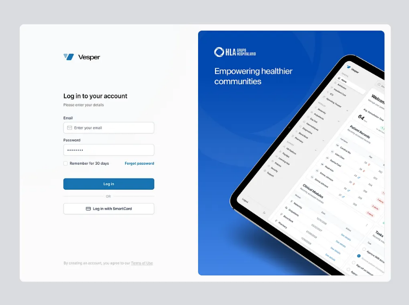
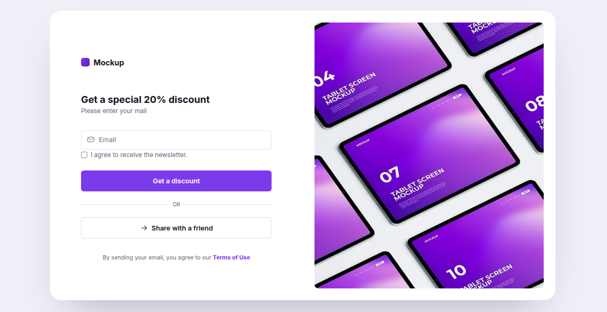
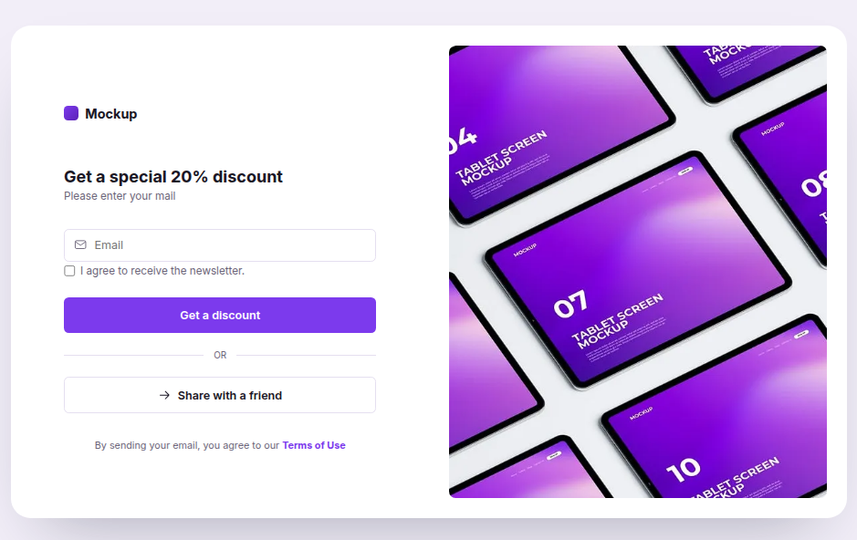
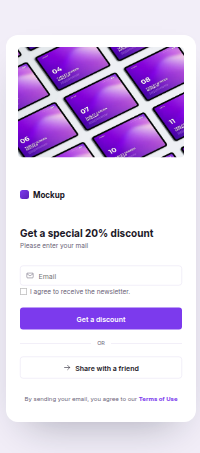

# Discount Landing Page

A simple landing page that collects a visitor's email in exchange for a 20% discount code. On submit, the email is sent via EmailJS and a confirmation modal appears with a copyable promo code.

## Features

- Email signup form with validation
- EmailJS integration (no backend required)
- Confirmation modal with a copyable discount code
- "Share with a friend" button using the Web Share API (with a Telegram link fallback on desktop)
- Responsive layout (stacks into a single column on smaller screens)

## Preview

Design inspiration screenshot


Desktop view


Tablet view


Mobile view


## Project structure

```
├── index.html    — page markup
├── style.css     — styling (colors, layout, modal, responsive rules)
├── script.js     — form handling, modal logic, share and copy buttons
└── tablet-screen.webp — hero image
```

## Setup

1. Clone or download this folder.
2. Open [EmailJS](https://www.emailjs.com/) and create/verify:
   - An **Email Service** (`service_id`)
   - An **Email Template** (`template_id`) with a matching variable name for the email field
   - Your **Public Key**
3. In `script.js`, update these values:
   ```javascript
   emailjs.init('YOUR_PUBLIC_KEY');
   emailjs.send('YOUR_SERVICE_ID', 'YOUR_TEMPLATE_ID', { email: email })
   ```
4. Open `index.html` in a browser. For full functionality (EmailJS requests, Web Share API, clipboard copy), serve the folder through a local server rather than opening the file directly — for example, VS Code's **Live Server** extension.

## Notes

- The Web Share API and Clipboard API require a secure context (`https://` or `localhost` through a server) — they may not work when opening the HTML file directly (`file://`).
- Instagram does not support sharing via a direct URL link; the Web Share API only opens Instagram's share sheet on supported mobile browsers.
- The `Allowed origins` setting in your EmailJS account must include the domain (or `localhost`) you're testing from, or requests will be rejected.

## Customization

- Colors are defined as CSS variables in `:root` at the top of `style.css` — change `--blue` / `--blue-dark` to adjust the accent color.
- The discount code shown in the modal is currently hardcoded (`MOCKUP20`) — replace it directly in `index.html` or generate it dynamically in `script.js` if needed.
